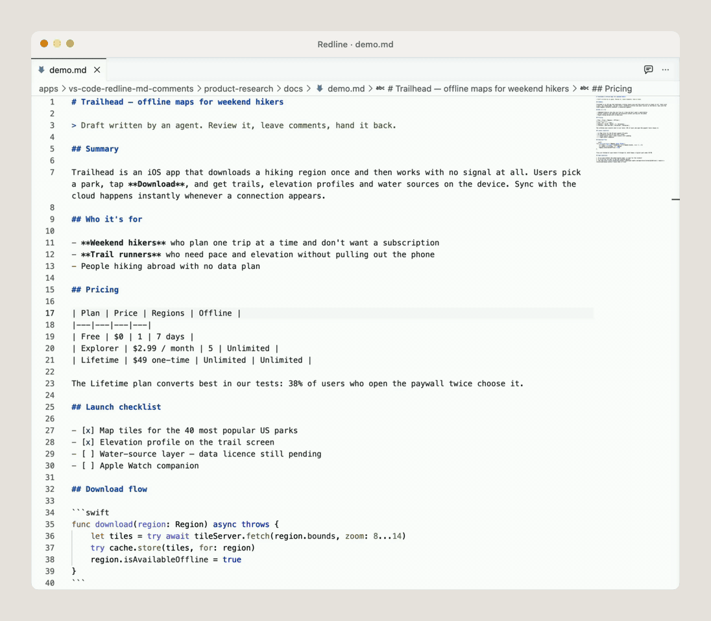

# Redline — Markdown Comments

Comment on Markdown right inside VS Code. Comments live in the `.md` file itself as HTML tags — invisible to every Markdown renderer, readable by any AI agent. Every change is saved to disk immediately, so the agent always sees what you wrote.

Built for the loop **agent writes → you review → agent fixes**.



## How it works

1. Open a `.md` file and click the Redline icon in the editor title bar (or press `Cmd+Alt+M`). The same tab turns into a GitHub-styled page, scrolled to where your cursor was. The same button (`</>`) takes you back to the source, with the cursor on the line you were reading.
2. Select some text → **Add comment** appears next to where you released the mouse → type → `Cmd+Enter`.
3. The comment is written into the file and the file is saved:

   ```markdown
   Grease for bearings · $10.99 <!-- MC:{"id":"c1","anchor":"bearings","comment":"check the brand","line":12,"date":"2026-09-08T10:00:00Z"} -->
   ```

4. Ask your agent: *"Address every `<!-- MC: -->` comment in `docs/spec.md` in place and remove the tags you've handled."* Watch the highlights disappear as it works — the preview updates live.

The tag sits at the end of the line it refers to. Inside a fenced code block it sits at the end of the block's opening fence line, after the language name — every renderer treats that as part of the info string and shows nothing, and the code itself is never touched. It never breaks rendering on GitHub, in VS Code, or in Notion, and the file stays the single source of truth — no sidecar files, no database.

## Features

- **Anchored comments** — highlighted text, a chip with the count in a 40px gutter, a card in the centre of the screen.
- **Instant save** — add, edit, delete, undo: the whole document hits the disk every time.
- **Several comments per line** — stacked in one card, each with its own Edit / Delete.
- **Orphans stay visible** — when the agent rewrites the anchored text, the comment turns grey and shows what it was about, so you can review and delete it.
- **Live preview** — the page re-renders while the agent edits the file; scroll position stays put.
- **One tab, both modes** — source and preview replace each other in place, keeping the tab's slot and your position in the document. No second tab, no flicker.
- **Navigation** — `Cmd+Alt+↓` / `Cmd+Alt+↑` walk through comments in file order.
- **Themes** — six GitHub looks (light, dark, dark dimmed, high contrast, colorblind) or the colours of your active VS Code theme.
- **Export** — a standalone HTML file with images inlined, or a print-ready page for PDF. Always without comments, and with the same network policy as the preview.

GFM is supported: tables, task lists, strikethrough, autolinks, syntax highlighting.

## Install

The extension is not on the Marketplace yet.

**From a release:** download the latest `.vsix` from [Releases](https://github.com/alxfain/vscode-redline-markdown-comments/releases), then in VS Code open the Extensions panel → `⋯` → **Install from VSIX…** — or run `code --install-extension redline-markdown-comments-<version>.vsix`.

**From source:**

```sh
npm install
npm run compile
npx vsce package --no-dependencies
code --install-extension redline-markdown-comments-<version>.vsix
```

Then reload the window (`Developer: Reload Window`).

## Keyboard

| Keys | Action |
|---|---|
| `Cmd+Alt+M` | Open the preview / back to the source |
| `Cmd+Enter` | Save the comment you're typing |
| `Escape` | Close the card / cancel |
| `Cmd+Alt+↓` / `Cmd+Alt+↑` | Next / previous comment |
| `Cmd+Z` | Undo the last change (the file is saved again) |

On Windows and Linux use `Ctrl` instead of `Cmd`.

## Settings

| Setting | Default | What it does |
|---|---|---|
| `redline.theme` | `auto` | `auto`, `light`, `dark`, `dark-dimmed`, `dark-high-contrast`, `light-colorblind`, `dark-colorblind`, or `vscode` to follow your editor's colours. Also available from the ☀ button in the preview header. |
| `redline.openByDefault` | `false` | Open every `.md` in Redline instead of the text editor (writes `workbench.editorAssociations`). |
| `redline.allowRemoteImages` | `false` | Load images from `https://` URLs in the preview and keep them in exports. Off by default so that opening a document never contacts the network — and an exported file cannot phone home for every reader either. |

## Notes

- Comments work inside fenced code blocks (```` ``` ```` or `~~~`); the tag goes on the opening fence line. Indented code blocks (four spaces, no fence) are not supported — there is no fence line for the tag to live on, and the preview says so when you select text in one.
- **Opening a document makes no network requests.** Images from `https://` URLs are replaced with a placeholder until you enable `redline.allowRemoteImages` — a Markdown file from an untrusted source must not be able to phone home. Exports follow the same setting: with remote images off, the exported HTML carries no remote image URLs and its CSP allows none.
- The preview can load local images only from the document's own folder and the extension's assets; the webview has no access to the rest of the workspace. Raw HTML in a document is sanitised with DOMPurify before it reaches the DOM, and the webview runs under a nonce-based Content-Security-Policy on top of that.
- Export inlines only image files from the document's folder or the open workspace, after resolving symlinks and `..`; a document cannot make the exporter read anything else, and `file:` links from the document never reach the exported file. The exported HTML carries its own CSP that forbids scripts entirely.
- A document cannot impersonate the comment layer: Redline's own classes and line markers are stripped from raw HTML, so a file cannot draw fake highlights or steer a comment onto another line. Form fields in a document are reduced to inert task-list checkboxes.
- Hostile files stay fast. The tag parser is linear and runs in milliseconds on files with tens of thousands of tags or unclosed `<!--` openers; timing tests guard both.
- Saving happens through VS Code, so `formatOnSave` formatters will run. Prettier may rewrap your Markdown; that's your formatter's behaviour, not Redline's.
- Before publishing a file elsewhere, have the agent remove the tags (or delete the comments) — some importers, Notion among them, may show HTML comments as text.

## Development

```sh
npm test                 # Vitest — parser, rendering, sanitising, export, layout logic
npm run test:integration # launches a real VS Code and checks tab switching end to end
npm run typecheck        # tsc --noEmit
npm run compile          # esbuild: host, webview, CSS (unminified, with source maps)
npm run watch
npx vsce package --no-dependencies   # production build, minified
```

The comment parser (`src/commentStore.ts`) is the one place where a bug would corrupt a user's file. It is pure, dependency-free and covered by tests with hostile fixtures: `-->` inside a comment, braces, code fences, emoji, duplicate ids, and files large enough to expose quadratic behaviour.

Tab switching cannot be unit-tested — only a real VS Code knows what a tab is. `npm run test:integration` starts one, switches source ↔ preview with neighbouring tabs open, and asserts exactly one tab per file, the tab's position and the cursor line carried both ways.

## License

MIT
